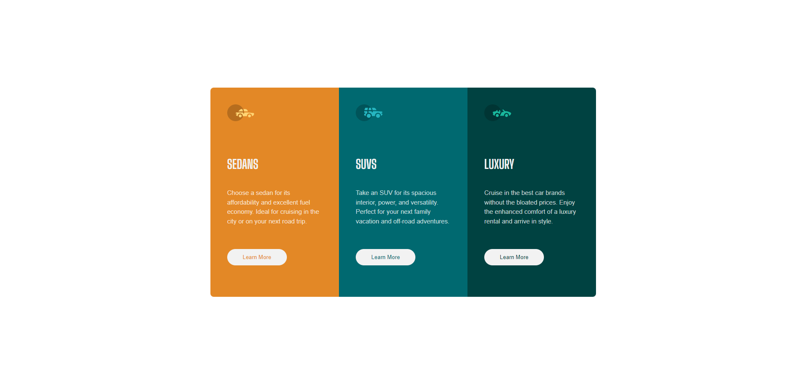
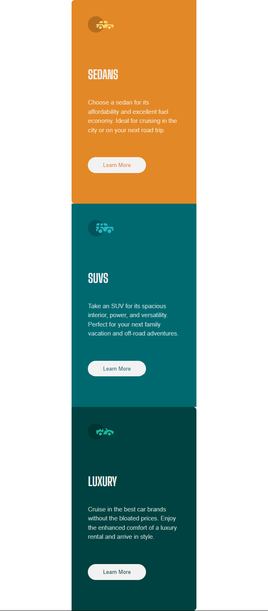

# Frontend Mentor - 3-column preview card component solution

This is a solution to the [3-column preview card component challenge on Frontend Mentor](https://www.frontendmentor.io/challenges/3column-preview-card-component-pH92eAR2-). Frontend Mentor challenges help you improve your coding skills by building realistic projects.

## Table of contents

- [Overview](#overview)
  - [The challenge](#the-challenge)
  - [Screenshot](#screenshot)
  - [Links](#links)
- [My process](#my-process)
  - [Built with](#built-with)
  - [What I learned](#what-i-learned)
  - [Useful resources](#useful-resources)
- [Author](#author)

## Overview

### The challenge

Users should be able to:

- View the optimal layout depending on their device's screen size
- See hover states for interactive elements

### Screenshot

Passive state desktop:

Active State desktop:

Mobile state:

Links

- Solution URL: [here](https://github.com/Yahia-kilany/3-column-preview-card-component-main)
- Live Site URL: [here](https://yahia-kilany.github.io/3-column-preview-card-component-main/)

## My process

### Built with

- Semantic HTML5 markup
- CSS custom properties
- Flexbox

### What I learned

* Using flex wrap
* Styling buttons
* media rules

### Useful resources

* [https://www.w3schools.com](https://www.w3schools.com/) - invaluable rescourse for rechecking css and html properties.

### Author

- Frontend Mentor - [@Yahia-kilany](https://www.frontendmentor.io/profile/Yahia-kilany)
